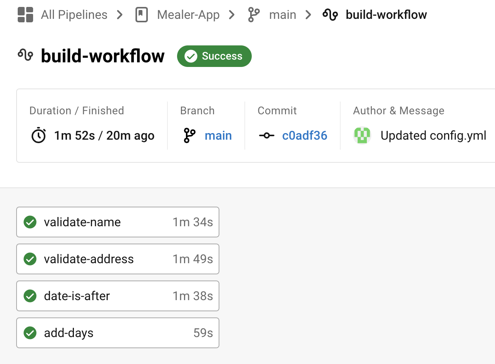

# Mealer-App
PROJECT MEMBERS GROUP 10

Easton Smith: 300189637

Nizar Zariouh: 300263208

Tolu Emoruwa: 300230905

Amine Hanan: 300202883

# Releases 

- v0.1:https://github.com/Raymond123/Mealer-App/releases/tag/v0.1

# Notes
Please note that all team members have made commits. However, the commits were made to branches that are now deleted Therefore, please refer to the closed pull requests section in order to view all the commits.

The Admin login credentials for the mealer app are as follows: (Username: admin@mealer.com , Password: adminroot)

Upon account creation or account password recovery please check your email's spam folder to make sure the verification link has been received.

We have integrated circleci into the app to run the 4 unit tests we have. (See circleci-testsimg to see the circleci dashboard where our tests ran succesfully)

